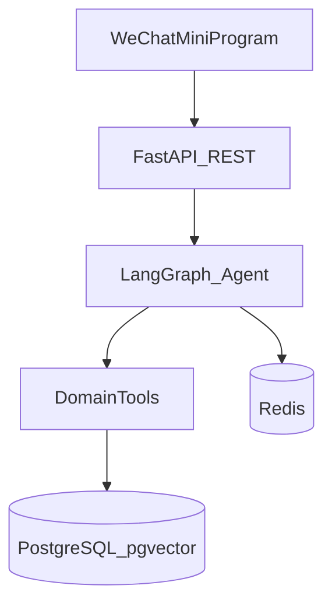

# Changsu

个人助手 Monorepo：微信小程序 + FastAPI/LangGraph 后端，统一由 **Bazel** 构建。

## 技术栈

| 层级 | 选型 |
|------|------|
| 构建 | Bazel 8 + Bzlmod |
| 后端 | FastAPI, LangGraph, SQLAlchemy, Alembic |
| Python 依赖 | uv (`backend/pyproject.toml`, `backend/uv.lock`) |
| 前端 | Taro 4 + React 19 + TypeScript |
| JS 依赖 | pnpm workspace (`pnpm-lock.yaml`) |
| 数据库 | PostgreSQL 16 + pgvector |
| 缓存 | Redis 7 |

## 目录结构

```
changsu/
├── MODULE.bazel          # Bzlmod 依赖（rules_python, rules_js, rules_ts）
├── backend/              # FastAPI + LangGraph 后端
├── frontend/miniapp/     # Taro 微信小程序
├── packages/shared/      # 共享 Zod 类型
└── docker-compose.yml    # Postgres + Redis
```

## 前置条件

- [Bazelisk](https://github.com/bazelbuild/bazelisk)（读取 `.bazelversion`）
- [uv](https://docs.astral.sh/uv/)（Python 依赖 lock）
- [pnpm](https://pnpm.io/) 9+（JS 依赖 lock）
- Docker（本地数据库）
- 微信开发者工具（预览小程序）
- 推荐：[ibazel](https://github.com/bazelbuild/bazel-watcher)（dev watch）

## 快速启动

### 1. 依赖 lock（首次或变更后）

```bash
cd backend && uv lock && cd ..
pnpm install
cp .env.example .env   # 按需修改
```

### 2. 基础设施

```bash
docker compose up -d
```

### 3. 后端

```bash
bazel run //backend:server
# 健康检查
curl http://localhost:8000/health
```

开发热重载（推荐）：

```bash
ibazel run //backend:server
```

### 4. 微信小程序

```bash
bazel run //frontend/miniapp:build
# 或 watch 模式
ibazel run //frontend/miniapp:dev
```

用微信开发者工具打开 `frontend/miniapp/dist/`，填入 `project.config.json` 中的 AppID。

### 5. 测试

```bash
bazel test //...
```

## Bazel 目标

| 目标 | 说明 |
|------|------|
| `//backend:lib` | 后端 Python 库 |
| `//backend:server` | 启动 uvicorn |
| `//backend:test` | 后端 smoke tests |
| `//packages/shared:shared` | 共享 TS 库 |
| `//frontend/miniapp:build` | 编译微信小程序 |
| `//frontend/miniapp:dev` | Taro watch |

## 扩展指南

### 新增业务领域（domain）

1. 在 `backend/app/domains/<name>/` 添加模块
2. 在 `backend/app/agents/tools/` 注册 LangGraph tool
3. 更新 `backend/BUILD.bazel` 的 `srcs` glob（如需要）
4. 添加 router 并在 `app/main.py` 挂载

### 新增前端页面

1. 在 `frontend/miniapp/src/pages/` 添加页面
2. 更新 `src/app.config.ts` 的 `pages` 列表
3. 共享类型放入 `packages/shared/src/`

### 更新依赖

- Python：`cd backend && uv lock`，Bazel 通过 `MODULE.bazel` 的 `pip.parse(uv_lock=...)` 消费
- JS：修改 `package.json` 后 `pnpm install`，更新 `pnpm-lock.yaml`

## 架构



## 相关项目

- [expense-tracker](../expense-tracker) — 账单参考实现
- [garmin-sync](../garmin-sync) — 跑步数据来源
- [PocketLedger](../PocketLedger) — MCP 架构参考
